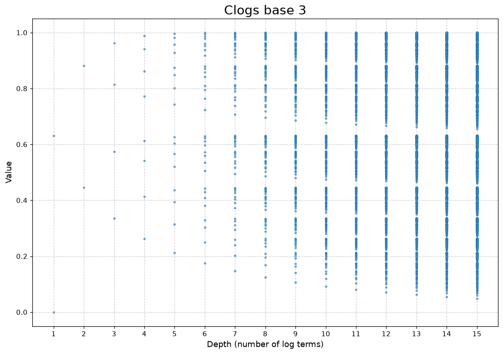
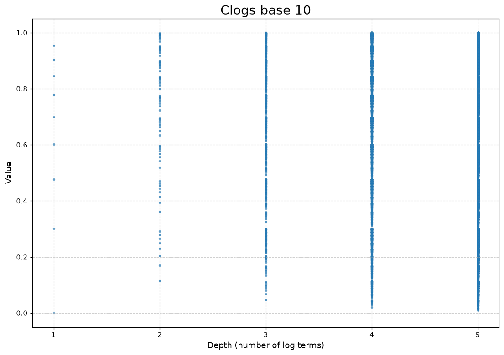
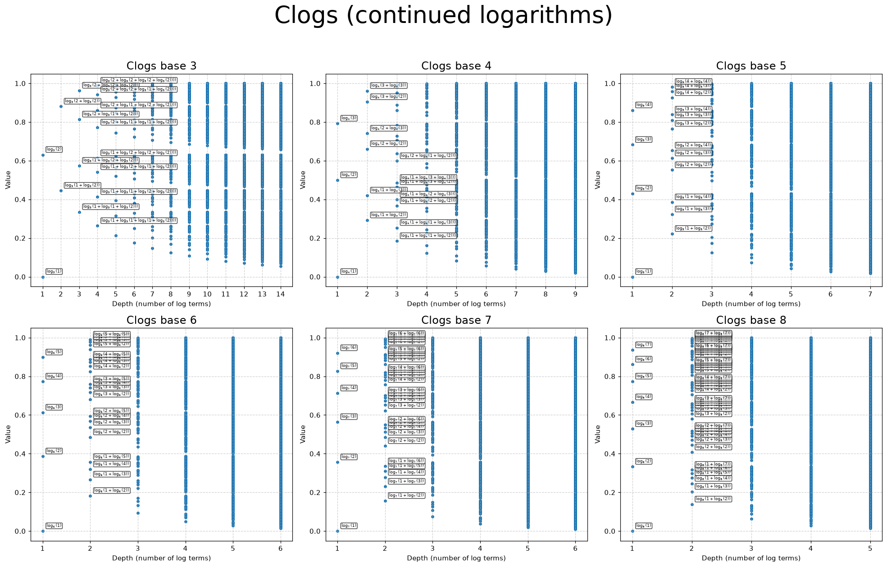

# Gallery

Each point is one finite continued logarithm (Neunhäuserer representation): the horizontal axis is depth (number of nested logs), the vertical axis is value. Generated by `tools/clogs.py`.

## Base 3

## Base 10

## Bases 3–8

